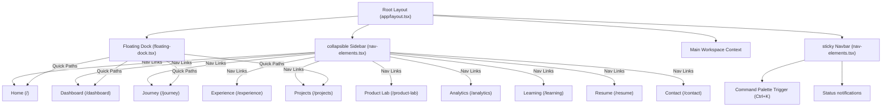

# Site Map Spec - CareerOS

This spec outlines the viewport structures and navigational adjustments for **CareerOS** across Desktop, Tablet, and Mobile screen sizes.

---

## 🖥️ 1. Desktop Site Map (Width >= 1024px)

On desktop, the navigation is fully expanded. A persistent sidebar controls global links, and a top navbar hosts quick actions and search, complemented by the Floating Dock at the bottom of the viewport.



---

## 平板 2. Tablet Site Map (768px <= Width < 1024px)

On tablets, the sidebar is collapsed into a compact icon bar by default to maximize content space. The Floating Dock is hidden, and top navbar controls mobile menu triggers for small tablet heights.

- **Global Navigation**: Collapsed icon-only Sidebar (16rem -> 4rem / 64px width).
- **Navbar**: Floating top headers containing the search command shortcut.
- **Layout Grid**: Responsive two-column charts adjust to vertical stacking.

---

## 📱 3. Mobile Site Map (Width < 768px)

On mobile viewports, the persistent Sidebar and Floating Dock are completely hidden. All navigational items are moved to a collapsible hamburger dropdown drawer overlay.

```text
Mobile Viewport Layout
├── Top Header Bar (Navbar)
│   ├── Mini Brand Logo ("NaveenOS")
│   └── Hamburger Menu Icon (Trigger button)
│       └── Collapse Dropdown Drawer Overlay
│           ├── Home Link
│           ├── Career Dashboard Link
│           ├── Journey Link
│           ├── Experience Link
│           ├── Projects Link
│           ├── Product Lab Link
│           ├── Analytics Link
│           ├── Learning Link
│           ├── Resume Link
│           └── Contact Link
└── Content Body Frame (stretches to fill viewport, stacks grid items vertically)
```
